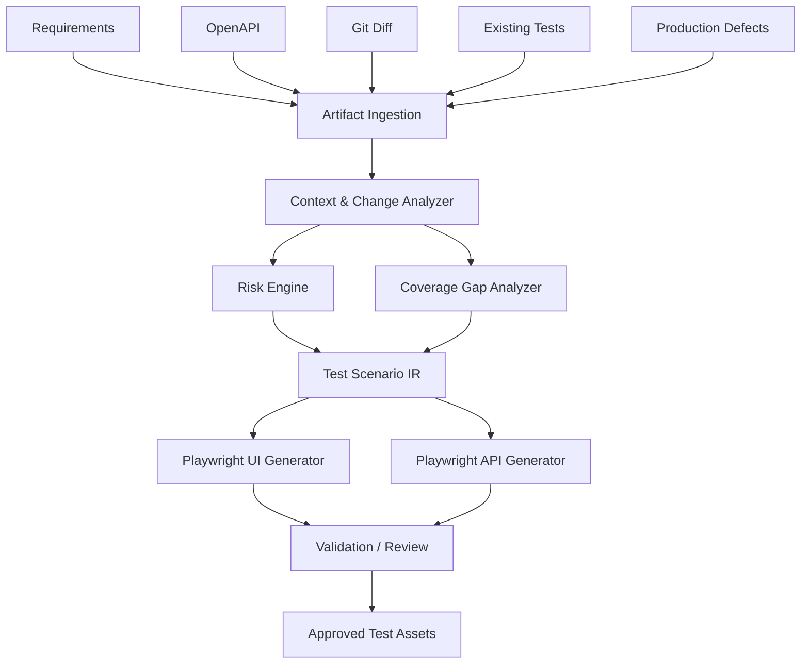

# Architecture

## Design principles
1. Evidence before generation: each scenario cites source artifacts.
2. Structured IR before code: model output should be schema-constrained.
3. Risk-based prioritization: business criticality, code-change surface, defect history and coverage gaps drive priority.
4. Human approval: generated tests are proposals, not silently merged code.
5. Provider independence: generation can use deterministic local logic or an external LLM adapter.
